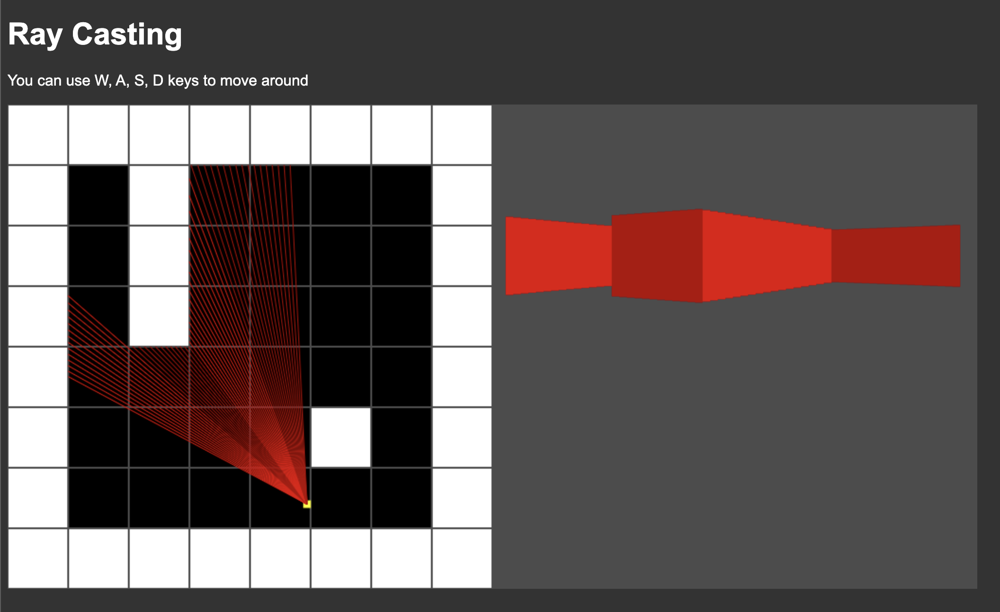

# ray-casting
A 3D view created by ray casting on a map

## Sample:

# Inspiration
I was watching this [youtube video](https://www.youtube.com/watch?v=gYRrGTC7GtA) and found the code easy to follow, so I wanted to port it to JavaScript.
